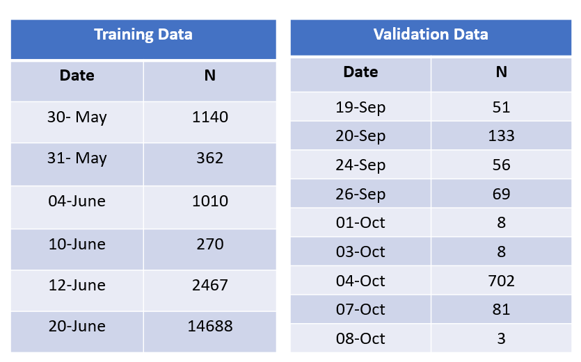

<html>
  <head>
  <style type="text/css">
    * {
      text-align: justify;
    }
    
    h2 {
      color: MidnightBlue;    
      font-weight: bold;
    }
    
    h3 {
      color: MidnightBlue;    
    }
    
    h4 {
       color: SteelBlue;    
     
    }
    
  </style>
  </head>
  <body>

Many real world applications need to know the localization of a user in the world to provide their services. Outdoor localization problem can be solved very accurately thanks to the inclusion of GPS sensors into the mobile devices. However, indoor localization is still an open problem mainly due to the loss of GPS signal in indoor environments. For this reason, we evaluated the application of machine learning techniques to this problem, replacing the GPS signal with WAPS signal.

For this purpose, we're going to use the UJIIndoorLoc database. It covers three buildings of Universitat Jaume I with four or more floors. You can read more about this dataset [here](https://archive.ics.uci.edu/ml/datasets/ujiindoorloc)

This report is intended to explain the process that I followed during the analysis. 

```{r eval=TRUE, echo=FALSE, warning=FALSE, include=FALSE}

# load Libraries: p_load can install, load,  and update packages

library(dplyr)
library(ggplot2)
library(lubridate)

# Load Data
df_datatrain <- read.csv2("trainingData.csv", header=TRUE, sep=",", stringsAsFactors=FALSE, na.strings=c("NA", "-", "?"))

df_datavalid<-read.csv2("validationData.csv", header=TRUE, sep=",",  stringsAsFactors=FALSE, na.strings=c("NA", "-", "?"))

```

## A. FIRST STEPS ##
### A.1. Exploratory analysis ###
**We were provided with two datasets with the same number of variables**:
<ul>
  <li>**Training Dataset**: it has 19,937 registers which were generated with an Android application called CaptureLoc. The users had to perform captures in different reference points.</li>
  
  <li>**Validation Dataset**: it has 1,111 registers which were generated with another Android application called ValidateLoc. This time, any reference point was provided to them, so they could capture signals in places which were not in the training phase.</li>
</ul>

**We start the exploration part analyzing if the different variables make sense and provide useful information for our goal:**
<ul>
  <li>**WAPS**: we have 520 different WAPS with signals from -104 to 0</li>
  
  <li>**The Building ID**: we have three different buildings (0,1,2)</li></br>
  <li>**The Floor**: we have four floors in the buildings 0 and 1 and five floors in the building 2.</li>
  {width=450px}
  <li>**The latitude**: -7691.338 to -7300.819</li></br>
  <li>**The longitude**:4.864.746 to 4.865.017</li></br>
  <li>**Space ID**: It’s used to identify the particular space (offices, labs, etc.). We have 123 types.</li></br>
  <li>**Relative Position**: It’s the relative position with respect to the space. It can be 1 (inside) or 2 (outside).</li></br>
  <li>**The user id**: 18 users participated in the procedure to generate the training samples. This field was no recorded in the validation phase, so the default value 0 was used to denote it.</li>
  {width=250px}
  <li>**The phone id**: 20 devices were used (25 if the Android version is considered).
</li>
<li>**The timestamp id**: the training phase took place during six days (from 30 May to 20 June 2013) and the validation phase during 9 days (from 19 Sep to 08 Oct)</li>
{width=350px}
</ul>

### A.2. Cleaning and preparing dataset ###
**In this process, we transform the raw data into consistent data that can be analyzed.**
<ul>
  <li>**Remove duplicated observations**: 637 duplicated registers</li>
  <li>**Handle missing values**: we didn’t find any missing value.</li>
  <li>**Change the value of WAPS = 100 to -110**
  <li>**Review the type of variables**: we carried out some tranformations</li>
  <li>**Get rid of the user 6**: it has 44% of the signals above -30, and it doesn't make sense.  </li>
  <li>**Remove “near-zero variance” predictors and registers**: this way we reduced the relevant waps to 313. We also removed 76 observations.</li>
  <li>**Remove WAP 248**: it seems to be in all buildings </li>
</ul>

## B. FEATURE ENGINEERING ##
It’s about creating new input features from the existing ones (we will use them in our predictions):
<ul>
<li>**The highes WAP**: we added to each row the name of the wap with the highest signal (in that register)</li>
<li>**The higher RSSI**: we added to each row the signal of the wap with the highest signal (in that register)</li>
<li>**A new ID combining building + Floor**: this way, we have 13 new combinations.</li>
</ul>

## C. MODELING & ERROR ANALYSIS ##
Here you can see a summary of the models that we trained. We selected the best models based on the analysis of error:</br>
  <li>**In classification**: we tried to avoid large errors in the identification of the floor, so we checked the classification matrix. For example: a large error can be predicting that someone is going to be on floor 3 when this person is actually on floor 0. </li>
  {width=500px}
  </br>
  <li>**In regression**: we tried to avoid those models with large outliers (even if they have a better R2/RMSE), so we checked the distribution of the errors</li>
    
</ul>

## D. RECOMMENDATIONS ##

## E. NEXT STEPS ##
- Normalize rows


